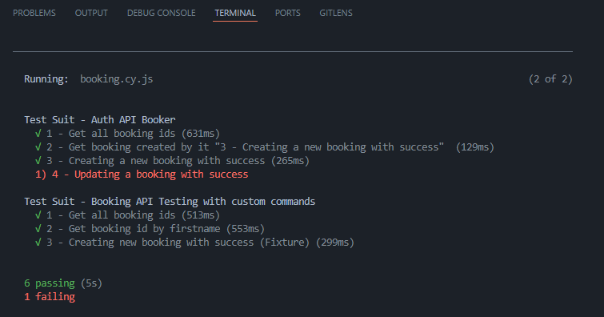

<h1>Booker API w/ Cypress and Javascript</h1>
<a href="https://restful-booker.herokuapp.com/apidoc/"><h3 align='center'>Esse projeto é destinado ao teste automatizado da API Restful Booker</h3></a>

    
    

     "Restful-booker is a <b>*Create Read Update Delete*</b> Web API that comes with authentication features and loaded with a bunch of bugs for you to explore"

<h3 align='center'>Tecnologias utilizadas:</h3>

    
    
    

     As tecnologias utilizadas para a implementação desse projeto foram <b>Cypress</b> e <b>javascript</b>, afim de explorar ao máximo a facilidade e rapidez da implementação de projetos com a linguagem Javascript, e a ferramenta Cypress (construída para testes e2e).

<h3>Observações gerais:</h3>

<b>Foram utilizados dois plugins para melhor visualização das requisições:</b>
  - `cypress-eslint-preprocessor`;
  - `cypress-plugin-api`;

<b>Existem duas formas de visualização das requisições, considerando os dois comandos:</b>
  - `npx cypress run` - para acompanhamento através do terminal;
   

 

  - `npx cypress open` - para exibir a ferramenta de acompanhamento do cypress;
 

<h3>Arquivo auth.cy.js</h3>

<b>Test Suit - Auth API Booker</b>
- Realizando autenticação com método POST;
- Validando se o token foi gerado devidamente;
 

<h3>Arquivo booking.cy.js</h3>

<b>Test Suit - Auth API Booker</b>
- Utilizadas requisições GET, POST e PUT;
- Efetuadas validações utilizadon expect;
- Inicializadas variáveis permitindo reaproveitamento dos conteúdos;
 

<b>Test Suit - Booking API Testing with custom commands</b>
- Utilizados custom commands;
- Utilizadas requisições GET, POST e PUT;
- Fixtures para maior segurannça e escalabilidade;

